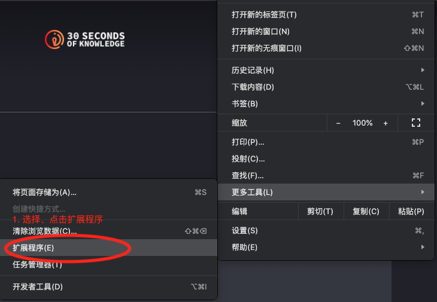
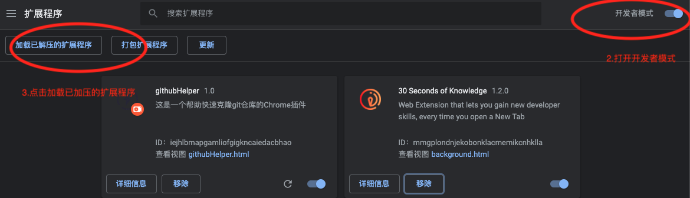
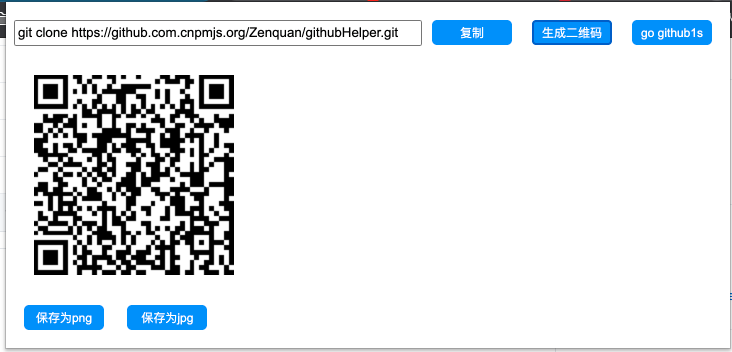

# githubHelper
## 背景

1. 快速git clone（github）

不知道从什么时候开始，git clone变得如此的慢，所以很多时候 git clone 都会出问题，最近看到有两个方案。

方案1：通过gitee或者coding先把要克隆的仓库从github中引入

- 优点：gitee或者coding国内的服务器，git clone非常快
- 缺点：这样多走一步，十分麻烦，不大推荐

方案2：则是git clone地址多加一点改变，譬如

https://github.com/Zenquan/githubHelper.git -> https://github.com.cnpmjs.org/Zenquan/githubHelper.git

- 优点：亲测！速度真的很快。
- 缺点：但是每次都要去这么拼凑一下十分麻烦，所以就写了这样一个简单的插件来解决这个需求

## 需求

- git clone (github)
	- [x] https://github.com/Zenquan/githubHelper ->  https://github.com.cnpmjs.org/Zenquan/githubHelper.git
	- [x] https://github.com/Zenquan/githubHelper/blob/master/js/content-script.js ->  https://github.com.cnpmjs.org/Zenquan/githubHelper.git
	- [x] https://github.com/Zenquan/githubHelper/tree/master/img ->  https://github.com.cnpmjs.org/Zenquan/githubHelper.git
	- [x] 点击按钮复制快速克隆的操作
- github1s
	- [x] 增加github1s的点击跳转
- 其他
	- [x] 生成和下载二维码

## 使用说明

1. 克隆到本地
```bash
git clone https://github.com.cnpmjs.org/Zenquan/githubHelper.git
```

2. 在浏览器里中




3. 最后的效果



## 备注说明
克隆下来的目录的.git/config中的

```bash
[remote "origin"]
	url = https://github.com.cnpmjs.org/Zenquan/githubHelper.git
```
url为`https://github.com.cnpmjs.org`的服务链接，并不是`https://github.com`， 所以需要`git push`时，重新登录github账号，或者会push失败，所以解决方案是把以上`https://github.com.cnpmjs.org`改为`https://github.com`。